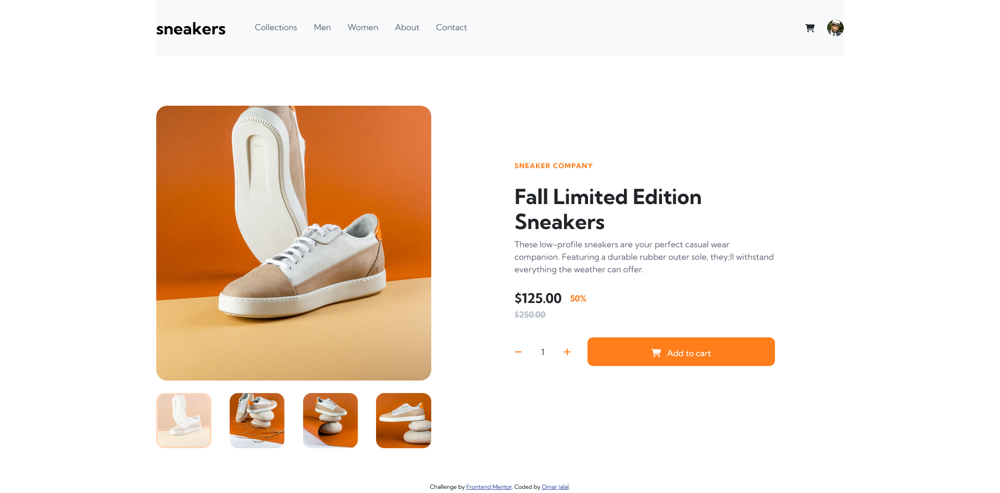
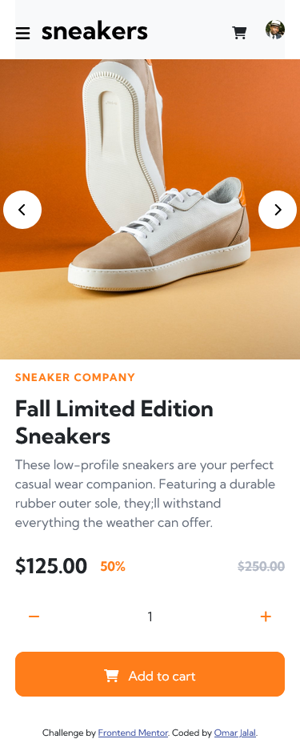

# Frontend Mentor - E-commerce product page solution

This is a solution to the [E-commerce product page challenge on Frontend Mentor](https://www.frontendmentor.io/challenges/ecommerce-product-page-UPsZ9MJp6). Frontend Mentor challenges help you improve your coding skills by building realistic projects.

## Table of contents

- [Overview](#overview)
  - [The challenge](#the-challenge)
  - [Screenshot](#screenshot)
  - [Links](#links)
  - [Built with](#built-with)
- [Author](#author)

## Overview

### The challenge

Users should be able to:

- View the optimal layout for the site depending on their device's screen size
- See hover states for all interactive elements on the page
- Open a lightbox gallery by clicking on the large product image
- Switch the large product image by clicking on the small thumbnail images
- Add items to the cart
- View the cart and remove items from it

### Screenshot

#### Desktop Layout Screenshot

#### Mobile Layout Screenshot

### Links

- Solution URL(https://github.com/omar-jalal/Advice-Generator-App/)
- Live Site URL: (https://e-commerce-product-page-phi.vercel.app/)

### Built with

- Grid
- Semantic HTML5 markup
- CSS custom properties
- Flexbox
- Animations
- Transitions
- Mobile-first workflow
- [Sass](https://sass-lang.com/) - Better Css Workflow Library
- [Postcss Load Config](https://www.npmjs.com/package/postcss-load-config) Postcss Loader for Vite
- [Autoprefixer](https://autoprefixer.github.io/) Postcss plugin
- [Bootstrap 5.0](https://getbootstrap.com/) - Css Components Framework
- [Vite](https://vitejs.dev/) - Bundler
- [Fontawesome](https://fontawesome.com/) - Icons Library

## Author

- Website - [Omar Jalal](https://github.com/omar-jalal)
- Frontend Mentor - [Omar Jalal](https://www.frontendmentor.io/profile/tiger8707)
- LinkedIn - [Omar Jalal](https://www.linkedin.com/in/omar-jalal-195b40163/)